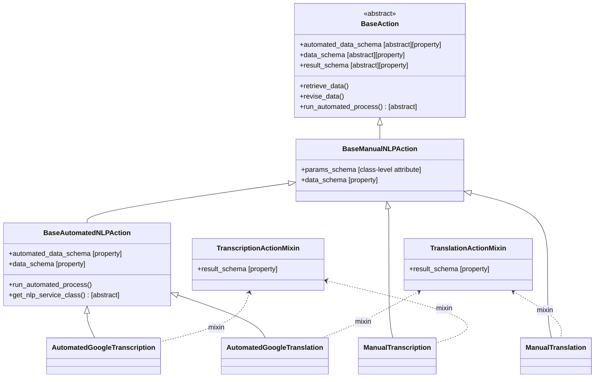
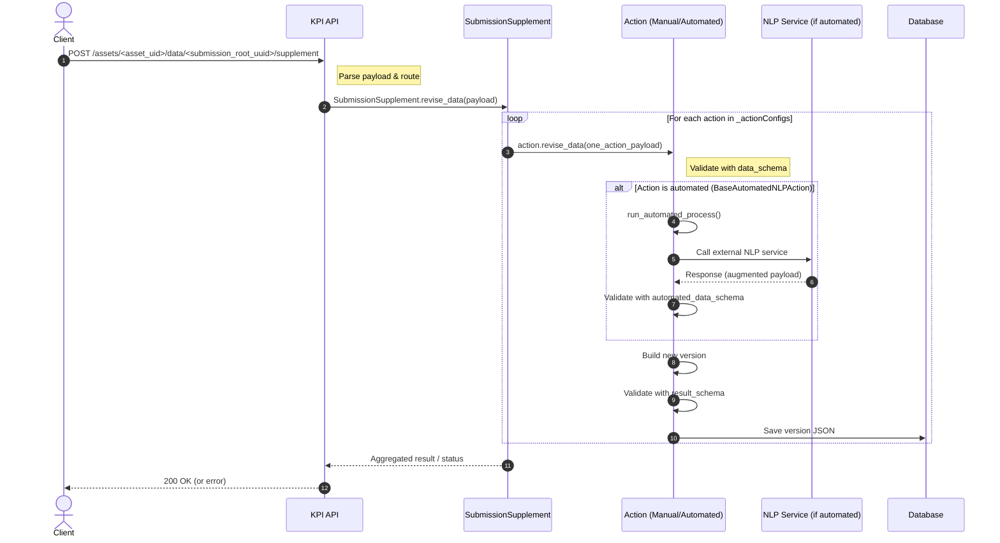
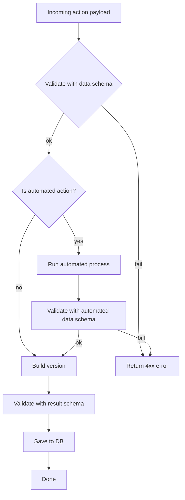

# Subsequence Actions – Supplement Processing Flow

This document explains the full flow when a client submits a **supplement** payload to the API.
It covers how the payload is validated through the various schemas (`params_schema`, `data_schema`, `automated_data_schema`, `result_schema`), how external NLP services are invoked for automated actions, and how versions are created and persisted.

---

## Table of Contents

1. [Class Overview](#1-class-overview)
2. [Subsequence Workflow](#2-subsequence-workflow)
   1. [Enabling an Action](#21-enabling-an-action)
   2. [Add Submission Supplement](#22-add-submission-supplement)
   3. [Sequence Diagram (End-to-End Flow)](#23-sequence-diagram-end-to-end-flow)
   4. [Flowchart (Logic inside revise_data per Action)](#24-flowchart-logic-inside-revise_data-per-action)
3. [Where Schemas Apply](#3-where-schemas-apply)

---

## 1. Class Overview

> The following diagram shows the inheritance tree and how mixins provide `result_schema`.



---

## 2. Subsequence Workflow

### 2.1 Enabling an Action

To enable an action on an Asset, its configuration must be added under
`Asset.advanced_features`. This configuration is used to **instantiate the
action** with its parameters and is validated against the action's
`params_schema`.

**Example: Enable Manual Transcription**

PATCH the asset with:

```json
{
  "_version": "20250820",
  "_actionConfigs": {
    "question_name_xpath": {
      "action_id": <params>,
      "other_action_id": <params>
    }
  }
}
```

**Example: Manual transcription in English and Spanish**

```json
{
  "_version": "20250820",
  "_actionConfigs": {
    "audio_question": {
      "manual_transcription": [{"language": "en"}, {"language": "es"}]
    }
  }
}
```

---

### 2.2 Add Submission Supplement

You need to PATCH the submission supplement with this payload:

#### Generic request

```
PATCH /api/v2/assets/<asset_uid>/data/<submission_root_uuid>/supplement/
```

```json
{
  "_version": "20250820",
  "question_name_xpath": {
    "action_id": <params>
  }
}
```

#### Example: Manual transcription in English

```json
{
  "_version": "20250820",
  "audio_question": {
    "manual_transcription": { "language": "en", "value": "My transcript" }
  }
}
```

---

### 2.3 Sequence Diagram (End-to-End Flow)

> This diagram illustrates the complete call flow from the client request to persistence.



---

### 2.4 Flowchart (Logic inside `revise_data` per Action)

> This diagram shows the decision tree when validating and processing a single action payload.



---

## 3. Where Schemas Apply

- **`params_schema`** (class-level attribute, `BaseManualNLPAction`)
  Defines the schema for the parameters used to instantiate the action.
  These parameters are configured when the action is enabled on the **Asset**
  and are stored under `Asset.advanced_features`.
  > Example: `[ { "language": "en" }, { "language": "es" } ]`

- **`data_schema`** (property)
  Validates the **client payload** for a given action.
  > Example: `{ "language": "en", "value": "My transcript" }`

- **`automated_data_schema`** (property, automated actions only)
  Validates the **augmented payload** returned by the external service.

- **`result_schema`** (property, via mixin)
  Validates the **version JSON** that is persisted and returned.
