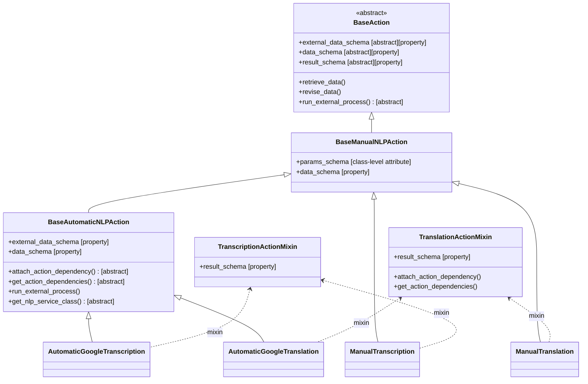
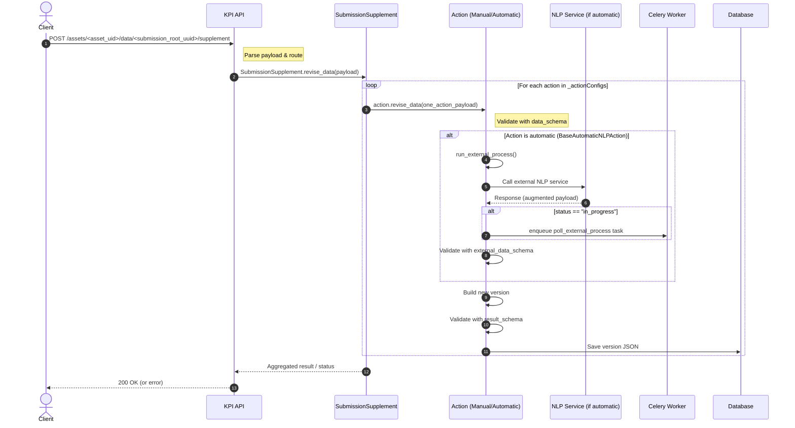
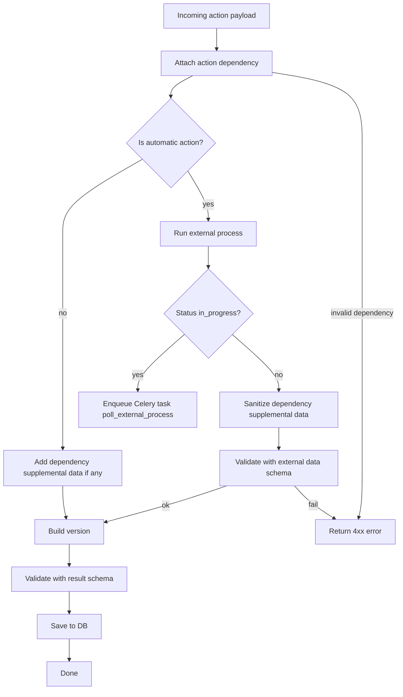

# Subsequence Actions – Supplement Processing Flow

This document explains the full flow when a client submits a **supplement** payload to the API.
It covers how the payload is validated through the various schemas (`params_schema`, `data_schema`, `external_data_schema`, `result_schema`), how external NLP services are invoked for automatic actions, and how versions are created and persisted.

---

## Table of Contents

1. [Class Overview](#1-class-overview)
2. [Subsequence Workflow](#2-subsequence-workflow)
   1. [Enabling an Action](#21-enabling-an-action)
   2. [Add Submission Supplement](#22-add-submission-supplement)
   3. [Sequence Diagram (End-to-End Flow)](#23-sequence-diagram-end-to-end-flow)
   4. [Flowchart (Logic inside revise_data per Action)](#24-flowchart-logic-inside-revise_data-per-action)
3. [Where Schemas Apply](#3-where-schemas-apply)

---

## 1. Class Overview

> The following diagram shows the inheritance tree and how mixins provide `result_schema`.



---

## 2. Subsequence Workflow

### 2.1 Enabling an Action

To enable an action on an Asset, its configuration must be added to the
`advanced_features_set` on the Asset by creating a new `QuestionAdvancedFeature` object.
This configuration is used to **instantiate the
action** with its parameters and is validated against the action's
`params_schema`.

**Example: Enable Manual Transcription**

POST to `/api/v2/assets/{uid_asset}/advanced-features/` with:

```json
{
    "question_xpath": <question_xpath>,
    "action": <action_id>,
    "params": <params>
}
```

**Example: Manual transcription in English and Spanish**

```json
{
  "question_xpath": "audio_question",
  "action": "manual_transcription",
  "params": [{"language": "en"}, {"language": "es"}]
}
```

**Example: Enable Qual action**

```json
{
  "question_xpath": "text_question",
  "action": "qual",
  "params": [
    {
      "type": "qualSelectOne",
      "uuid": "1a8b748b-f470-4c40-bc09-ce2b1197f503",
      "labels": { "_default": "Was this a first-hand account?" },
      "choices": [
        { "uuid": "3c7aacdc-8971-482a-9528-68e64730fc99", "labels": { "_default": "Yes" } },
        { "uuid": "7e31c6a5-5eac-464c-970c-62c383546a94", "labels": { "_default": "No" } }
      ]
    },
    {
      "type": "qualInteger",
      "uuid": "1a2c8eb0-e2ec-4b3c-942a-c1a5410c081a",
      "labels": { "_default": "How many characters appear in the story?" }
    }
  ]
}
```

---

### 2.2 Add Submission Supplement

You need to PATCH the submission supplement with this payload:

#### Generic request

```
PATCH /api/v2/assets/<asset_uid>/data/<submission_root_uuid>/supplement/
```

```json
{
  "_version": "20250820",
  "question_name_xpath": {
    "action_id": <params>
  }
}
```

#### Example: Manual transcription in English

```json
{
  "_version": "20250820",
  "audio_question": {
    "manual_transcription": { "language": "en", "value": "My transcript" }
  }
}
```

#### Example: Qual action

```json
{
  "_version": "20250820",
  "text_question": {
    "qual": {
      "uuid": "q_uuid",
      "value": "sentiment_pos"
    }
  }
}
```

---

### 2.3 Sequence Diagram (End-to-End Flow)

This section explains how the system handles a supplement from the initial
client request, through validation and optional background retries.

#### 2.3.1 Sequence Diagram – End-to-End

> The diagram shows the synchronous request until the first response.



---

#### 2.3.2 Background Polling with Celery

If run_external_process receives a response like:

```json
{"status": "in_progress"}
```


a Celery task (e.g. poll_external_process) is queued.
This task will periodically re-invoke the external service until the action’s
status becomes complete or a maximum retry limit is reached.
The task uses the same validation chain (external_data_schema → result_schema)
before persisting the final revision.

---

#### 2.3.3 Flowchart (Logic inside `revise_data` per Action)

> This diagram shows the decision tree when validating and processing a single action payload.



---

## 3. Where Schemas Apply

Every action relies on a set of schemas to validate its lifecycle:
- **`params_schema`** – defines how the action is instantiated and configured on the Asset.
- **`data_schema`** – validates the client payload sent in supplements.
- **`external_data_schema`** – extends `data_schema` for automatic actions by adding status and system-generated fields.
- **`result_schema`** – validates the persisted revision format, including metadata and version history.

---

### 3.1 `params_schema`

Defined on all classes inheriting from `BaseAction`.
It describes the configuration stored on a `QuestionAdvancedFeature` when an action is enabled.

**Example: enabling Manual Transcription in English and Spanish**

```json
{
  "question_xpath": "audio_question",
  "action": "manual_transcription",
  "params": [{"language": "en"}, {"language":  "es"}]
}
```

**Example: enabling Qual**

```json
{
  "question_xpath": "text_question",
  "action": "qual",
  "params": [
    {
      "type": "qualSelectOne",
      "uuid": "1a8b748b-f470-4c40-bc09-ce2b1197f503",
      "labels": { "_default": "Was this a first-hand account?" },
      "choices": [
        { "uuid": "3c7aacdc-8971-482a-9528-68e64730fc99", "labels": { "_default": "Yes" } },
        { "uuid": "7e31c6a5-5eac-464c-970c-62c383546a94", "labels": { "_default": "No" } }
      ]
    },
    {
      "type": "qualInteger",
      "uuid": "1a2c8eb0-e2ec-4b3c-942a-c1a5410c081a",
      "labels": { "_default": "How many characters appear in the story?" }
    }
  ]
}
```

---

### 3.2 `data_schema`

Validates the **client payload** sent for a supplement.
Each action has its own expected format:

- **Manual Transcription**
  ```json
  { "language": "en", "value": "My transcript" }
  ```

- **Manual Translation**
  ```json
  { "language": "en", "value": "My translation" }
  ```

- **Automatic Transcription / Automatic Translation**
  ```json
  { "language": "en" }
  ```

- **All actions – delete request**
  ```json
  { "language": "en", "value": null }
  ```

- **Qual**
  ```json
  {
    "uuid": "q_uuid",
    "value": "sentiment_pos"
  }
  ```

---

### 3.3 `external_data_schema`

Used only for **automatic actions** (`BaseAutomaticNLPAction`).
It validates the **augmented payload** returned by the external service.

- **Example (complete)**
  ```json
  { "language": "en", "value": "My automatic result", "status": "complete" }
  ```

- **Example (in progress)**
  ```json
  { "language": "en", "status": "in_progress" }
  ```

- **Example (deleted)**
  ```json
  { "language": "en", "status": "deleted", "value": null }
  ```

- **Example (failed)**
  ```json
  { "language": "en", "status": "failed", "error": "Could not process action" }
  ```

---

### 3.4 `result_schema`

Validates the **revision JSON** persisted in the database.
The structure is the same for both manual and automatic actions:

- Metadata about the action itself (`_dateCreated`, `_dateModified`).
- A list of versions under `_versions`, each containing:
  - A nested `_data` object with properties from either `data_schema` (manual) or `external_data_schema` (automatic).
  - Audit fields (`_dateCreated`, `_dateAccepted`, `_uuid`).

**Manual Action Example**

```json
{
  "_dateCreated": "2025-08-21T20:55:42Z",
  "_dateModified": "2025-08-21T20:57:28Z",
  "_versions": [
    {
      "_data": {
        "language": "en",
        "value": "My manual transcript"
      },
      "_dateCreated": "2025-08-21T20:57:28Z",
      "_dateAccepted": "2025-08-21T20:57:28Z",
      "_uuid": "4dcf9c9f-e503-4e5c-81f5-74250b295001"
    },
    {
      "_data": {
        "language": "en",
        "value": "My previous manual transcript"
      },
      "_dateCreated": "2025-08-21T20:55:42Z",
      "_dateAccepted": "2025-08-21T20:55:42Z",
      "_uuid": "850e6359-50e8-4252-9895-e9669a27b1ea"
    }
  ]
}
```

**Automatic Action Example**

```json
{
  "_dateCreated": "2025-08-21T20:55:42Z",
  "_dateModified": "2025-08-21T20:57:28Z",
  "_versions": [
    {
      "_data": {
        "language": "en",
        "value": "My automatic result",
        "status": "complete"
      },
      "_dateCreated": "2025-08-21T20:57:28Z",
      "_dateAccepted": "2025-08-21T20:57:28Z",
      "_uuid": "4dcf9c9f-e503-4e5c-81f5-74250b295001"
    },
    {
      "_data": {
        "language": "en",
        "value": "My previous automatic result",
        "status": "complete"
      },
      "_dateCreated": "2025-08-21T20:55:42Z",
      "_dateAccepted": "2025-08-21T20:55:42Z",
      "_uuid": "850e6359-50e8-4252-9895-e9669a27b1ea"
    }
  ]
}
```

**Qual Action Example**

```json
{
  "q1_uuid_here": {
    "_dateCreated": "2025-08-21T20:55:42Z",
    "_dateModified": "2025-08-21T20:57:28Z",
    "_versions": [
      {
        "_data": {
          "uuid": "q1_uuid_here",
          "value": "sentiment_pos"
        },
        "_dateCreated": "2025-08-21T20:57:28Z",
        "_dateAccepted": "2025-08-21T20:57:28Z",
        "_uuid": "4dcf9c9f-e503-4e5c-81f5-74250b295001"
      },
      {
        "_data": {
          "uuid": "q1_uuid_here",
          "value": "sentiment_neg"
        },
        "_dateCreated": "2025-08-21T20:55:42Z",
        "_dateAccepted": "2025-08-21T20:55:42Z",
        "_uuid": "850e6359-50e8-4252-9895-e9669a27b1ea"
      }
    ]
  },
  "q2_uuid_here": {
    "_dateCreated": "2025-08-21T20:55:42Z",
    "_dateModified": "2025-08-21T20:57:28Z",
    "_versions": [
      {
        "_data": {
          "uuid": "q2_uuid_here",
          "value": 8
        },
        "_dateCreated": "2025-08-21T20:57:28Z",
        "_dateAccepted": "2025-08-21T20:57:28Z",
        "_uuid": "91ab5f30-0f73-4e2e-b91f-8ad2f67a4729"
      }
    ]
  }
}
```

> For manual actions, the inner version objects correspond to `data_schema`.
>
> For automatic actions, they correspond to `external_data_schema`.

---

### 3.5 `result_schema` with dependencies

Some actions depend on the result of other actions.
For example, a **translation** action requires an existing **transcription**.
In this case, a `_dependency` property is added to the persisted JSON.

**Example: Automatic Translation result depending on an Automatic Transcription**

```json
{
  "_dateCreated": "2025-09-01T12:15:42Z",
  "_dateModified": "2025-09-01T12:17:28Z",
  "_versions": [
    {
      "_data": {
        "language": "fr",
        "value": "Mon audio a été traduit automatiquement",
        "status": "complete"
      },
      "_dateCreated": "2025-09-01T12:17:28Z",
      "_uuid": "91ab5f30-0f73-4e2e-b91f-8ad2f67a4729",
      "_dependency": {
        "_uuid": "4dcf9c9f-e503-4e5c-81f5-74250b295001",
        "_actionId": "automatic_google_transcription"
      }
    }
  ]
}
```

- The `_dependency` object references the transcription result that the translation was built upon.
- It reuses the UUID and action ID from the transcription’s persisted result, ensuring referential integrity.
- This allows clients to trace back a translation to the exact transcription version it relied on.
