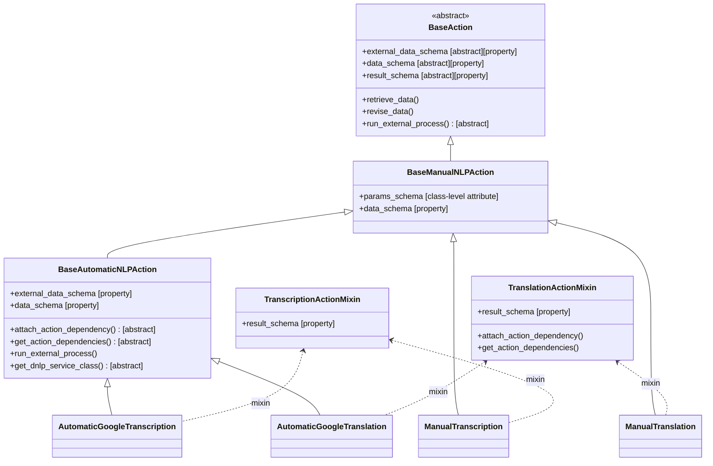

# Subsequence Actions – Supplement Processing Flow

This document explains the full flow when a client submits a **supplement** payload to the API.
It covers how the payload is validated through the various schemas (`params_schema`, `data_schema`, `external_data_schema`, `result_schema`), how external NLP services are invoked for automatic actions, and how versions are created and persisted.

---

## Table of Contents

1. [Class Overview](#1-class-overview)
2. [Subsequence Workflow - API](#2-subsequence-workflow---api)
   1. [Enabling an action](#21-enabling-an-action)
   2. [Updating an action](#22-updating-an-action)
   3. [Add submission supplement](#23-add-submission-supplement)
   4. [Remove submission supplement](#24-deleting-a-submission-supplement)
   5. [Example user flows](#25-example-user-flows)
      1. [Automatic transcription](#251-automatic-transcription)
      2. [Manual transcription/translation](#252-manual-transcriptiontranslation)
3. [Subsequence Workflow - Backend](#3-sequence-workflow---backend-end-to-end-flow)
   1. [Sequence diagram](#31-sequence-diagram--end-to-end)
   2. [Background polling with celery](#32-background-polling-with-celery)
   3. [Revise data flowchart](#33-flowchart-logic-inside-revise_data-per-action)
4. [Where Schemas Apply](#4-where-schemas-apply)
   1. [Parameters](#41-params_schema)
   2. [Data](#42-data_schema)
   3. [External data](#43-external_data_schema)
   4. [Results](#44-result_schema)
   5. [Results with dependencies](#45-result_schema-with-dependencies)

---

## 1. Class Overview

> The following diagram shows the inheritance tree and how mixins provide `result_schema`.



---

## 2. Subsequence Workflow - API

### 2.1 Enabling an Action

To enable an action on an Asset, its configuration must be added to the
`advanced_features_set` on the Asset by creating a new `QuestionAdvancedFeature` object.
This configuration is used to **instantiate the
action** with its parameters and is validated against the action's
`params_schema`.

**Example: Enable Manual Transcription**

POST to `/api/v2/assets/{uid_asset}/advanced-features/` with:

```json
{
    "question_xpath": <question_xpath>,
    "action": <action_id>,
    "params": <params>
}
```

**Example: Manual transcription in English and Spanish**

```json
{
  "question_xpath": "audio_question",
  "action": "manual_transcription",
  "params": [{"language": "en"}, {"language": "es"}]
}
```

**Example: Qualitative Analysis Text question**

```json
{
  "question_xpath": "text_question",
  "action": "manual_qual",
  "params": [
    {
      "type": "qualSelectOne",
      "uuid": "1a8b748b-f470-4c40-bc09-ce2b1197f503",
      "labels": { "_default": "Was this a first-hand account?" },
      "choices": [
        { "uuid": "3c7aacdc-8971-482a-9528-68e64730fc99", "labels": { "_default": "Yes" } },
        { "uuid": "7e31c6a5-5eac-464c-970c-62c383546a94", "labels": { "_default": "No" } }
      ]
    },
    {
      "type": "qualInteger",
      "uuid": "1a2c8eb0-e2ec-4b3c-942a-c1a5410c081a",
      "labels": { "_default": "How many characters appear in the story?" }
    }
  ]
}
```
To learn more, visit `/api/v2/docs/` on your KoboToolbox server.

Or use the public documentation endpoints:

- Global Server: [API documentation](https://kf.kobotoolbox.org/api/v2/docs/?q=/api/v2/assets/{uid_asset}/advanced-features/)
- EU Server: [API documentation](https://eu.kobotoolbox.org/api/v2/docs/?q=/api/v2/assets/{uid_asset}/advanced-features/)

---

### 2.2 Updating an Action

You can update the params of an action via a PATCH to `/api/v2/assets/{uid_asset}/advanced-features/{uid_feature}`

`params` are always additive. That means that if you PATCH a feature with a new param array, the new ones
will be added to the existing ones. You cannot delete a param via the API.

In the case of NLP actions, this means you can only add languages, not delete.
For example, given a `manual_transcription` action with `params=[{'language': 'en'}]`, PATCHing the endpoint
`/api/v2/assets/{uid_asset}/advanced-features/{uid_feature}` with
```json
{"params":  [{"language":  "fr"}]}
```
will result in
```json
{
  "params": [{"language": "en"}, {"language": "fr"}]
}
```

In the case of qualitative analysis questions, any question not present in a PATCH request will be marked as deleted.
Similarly, for multiple choice questions, if a choice is not present in the PATCH request, it will be marked as deleted.
The order of the questions will be updated to match the PATCH request, with deleted questions being put at the end.
For example, given the initial configuration
```json
{
  "params": [
    {
      "type": "qualInteger",
      "uuid": "1a2c8eb0-e2ec-4b3c-942a-c1a5410c081a",
      "labels": { "_default": "How many characters appear in the story?" }
    },
    {
      "type": "qualSelectOne",
      "uuid": "1a8b748b-f470-4c40-bc09-ce2b1197f503",
      "labels": { "_default": "Was this a first-hand account?" },
      "choices": [
        { "uuid": "3c7aacdc-8971-482a-9528-68e64730fc99", "labels": { "_default": "Yes" } },
        { "uuid": "7e31c6a5-5eac-464c-970c-62c383546a94", "labels": { "_default": "No" } }
      ]
    }
  ]
}
```

PATCHing the `api/v2/assets/{asset_uid}/advanced-features/{feature_uid}` with
```json
{
  "params": [
        {
      "type": "qualText",
      "uuid": "7b54db17-3a17-4138-aaae-6007866b9c34",
      "labels": { "_default": "Why did this happen?" }
    },
    {
      "type": "qualSelectOne",
      "uuid": "1a8b748b-f470-4c40-bc09-ce2b1197f503",
      "labels": { "_default": "Was this a first-hand account?" },
      "choices": [
        { "uuid":  "04d84733-f427-4a5c-b00b-81bca9da7f3c", "labels": { "_default":  "Maybe" } },
        { "uuid": "3c7aacdc-8971-482a-9528-68e64730fc99", "labels": { "_default": "Yes" } }
      ]
    }
  ]
}
```

will result in
```json
{
  "params": [
        {
      "type": "qualText",
      "uuid": "7b54db17-3a17-4138-aaae-6007866b9c34",
      "labels": { "_default": "Why did this happen?" }
    },
    {
      "type": "qualSelectOne",
      "uuid": "1a8b748b-f470-4c40-bc09-ce2b1197f503",
      "labels": { "_default": "Was this a first-hand account?" },
      "choices": [
        { "uuid":  "04d84733-f427-4a5c-b00b-81bca9da7f3c", "labels": { "_default":  "Maybe" } },
        { "uuid": "3c7aacdc-8971-482a-9528-68e64730fc99", "labels": { "_default": "Yes" } },
        {
          "uuid": "7e31c6a5-5eac-464c-970c-62c383546a94",
          "labels": { "_default": "No" },
          "options": { "deleted":  true }
        }
      ]
    },
    {
      "type": "qualInteger",
      "uuid": "1a2c8eb0-e2ec-4b3c-942a-c1a5410c081a",
      "labels": { "_default": "How many characters appear in the story?" },
      "options": { "deleted":  true }
    }
  ]
}
```

### 2.3 Add Submission Supplement

You need to PATCH the submission supplement with this payload:

#### Generic request

```
PATCH /api/v2/assets/<asset_uid>/data/<submission_root_uuid>/supplement/
```

```json
{
  "_version": "20250820",
  "question_name_xpath": {
    "action_id": <params>
  }
}
```

#### Example: Manual transcription in English

```json
{
  "_version": "20250820",
  "audio_question": {
    "manual_transcription": { "language": "en", "value": "My transcript" }
  }
}
```

### Example: Manual transcription with `locale` (optional)
You can optionally specify a `locale` to distinguish regional variations (e.g. en-US vs en-GB).

```json
{
  "_version": "20250820",
  "audio_question": {
    "manual_transcription": { "language": "en", "locale": "en-US", "value": "My transcript" }
  }
}
```

#### Example: Qualitative Analysis Text question

```json
{
  "_version": "20250820",
  "text_question": {
    "manual_qual": {
      "uuid": "q_uuid",
      "value": "sentiment_pos"
    }
  }
}
```
To learn more, visit `/api/v2/docs/` on your KoboToolbox server.

Or use the public documentation endpoints:

- Global Server: [API documentation](https://kf.kobotoolbox.org/api/v2/docs/?q=/api/v2/assets/{uid_asset}/data/{id}/supplement/)
- EU Server: [API documentation](https://eu.kobotoolbox.org/api/v2/docs/?q=/api/v2/assets/{uid_asset}/data/{id}/supplement/)

### 2.4 Deleting a Submission Supplement

To delete a submission supplement, you need to PATCH the submission supplement
with the appropriate null or empty value.


#### Example: Deleting a manual transcription in English

```json
{
  "_version": "20250820",
  "audio_question": {
    "manual_transcription": { "language": "en", "value": null }
  }
}
```

### Example: Deleting a manual transcription with `locale` (optional)
You can optionally specify a `locale` to distinguish regional variations (e.g. en-US vs en-GB).

```json
{
  "_version": "20250820",
  "audio_question": {
    "manual_transcription": { "language": "en", "locale": "en-US", "value": null }
  }
}
```

#### Example: Qualitative Analysis text question

```json
{
  "_version": "20250820",
  "text_question": {
    "manual_qual": {
      "uuid": "q_uuid",
      "value": ""
    }
  }
}
```

#### Example: Qualitative Analysis integer question

```json
{
  "_version": "20250820",
  "text_question": {
    "manual_qual": {
      "uuid": "q_uuid",
      "value": null
    }
  }
}
```

#### Example: Qualitative Analysis select one question

```json
{
  "_version": "20250820",
  "text_question": {
    "manual_qual": {
      "uuid": "q_uuid",
      "value": ""
    }
  }
}
```

#### Example: Qualitative Analysis select multiple question

```json
{
  "_version": "20250820",
  "text_question": {
    "manual_qual": {
      "uuid": "q_uuid",
      "value": []
    }
  }
}
```

#### Example: Qualitative Analysis tags question

```json
{
  "_version": "20250820",
  "text_question": {
    "manual_qual": {
      "uuid": "q_uuid",
      "value": []
    }
  }
}
```

### 2.5 Example user flows

#### 2.5.1 Automatic transcription

1. Enable automatic transcription in English
`POST /api/v2/assets/{uid_asset}/advanced-features/`
```json
{
  "question_xpath": "audio_question",
  "action": "automatic_google_transcription",
  "params": [{"language": "en"}]
}
```
Response:
```json
{
  "question_xpath":"audio_question",
  "action":"automatic_google_transcription",
  "params":[{"language":"en"}],
  "uid":"qaftnQRw6ZBNbNc9n7MSWzvx"
}
```

2. Request an automatic transcription in Spanish
`PATCH /api/v2/assets/{uid_asset}/data/{submission_root_uuid}/supplement/`
```json
{
  "_version": "20250820",
  "audio_question": {
    "automatic_google_transcription": {
      "language": "es"
    }
  }
}
```
Response:
`400 - Invalid payload`

3. Enable automatic transcription in Spanish
`PATCH /api/v2/assets/{uid_asset}/advanced-features/{uid_feature}/`
```json
{
  "params": [{"language": "es"}]
}
```
Response:
```json
{
  "params":[{"language":"en"},{"language":"es"}],
  "question_xpath":"audio_question",
  "action":"automatic_google_transcription",
  "asset":27,
  "uid":"qaftnQRw6ZBNbNc9n7MSWzvx"
}
```

4. Request automatic transcription in Spanish
`PATCH /api/v2/assets/{uid_asset}/data/{submission_root_uuid}/supplement/`
```json
{
  "_version": "20250820",
  "audio_question": {
    "automatic_google_transcription": {
      "language": "es"
    }
  }
}
```
Response:
```json
{
  "audio_question": {
    "automatic_google_transcription": {
      "_dateCreated":"2026-01-28T15:07:53.666960Z",
      "_dateModified":"2026-01-28T15:07:53.666960Z",
      "_versions": [
        {
          "_data": {
            "language":"es","status":"in_progress"
          },
          "_dateCreated":"2026-01-28T15:07:53.666960Z",
          "_uuid":"8df4a7f5-a05e-49a8-8620-d53dc0377535"
        }
      ]
    }
  },
  "_version":"20250820"
}
```

5. Poll to see if the transcription is done yet
`GET /api/v2/assets/{uid_asset}/data/{submission_root_uuid}/supplement/`
Response:
```json
{
   "audio_question":{
      "automatic_google_transcription":{
         "_versions":[
            {
               "_data":{
                  "value":"Hola mundo",
                  "status":"complete",
                  "language":"es"
               },
               "_uuid":"9adfb1cf-0b21-4cb6-9ade-6a6bdd9cc830",
               "_dateCreated":"2026-01-28T15:21:17.091030Z"
            },
           {
             "_data": {
               "status": "in_progress",
               "language": "es"
             },
             "_uuid": "148381b2-ea51-4085-9968-acbb8608e749",
             "_dateCreated": "2026-01-28T15:21:06.416445Z"
           }
         ],
        "_version":"20250820"
      }
   }
}
```

6. Accept the transcript
`PATCH /api/v2/assets/{uid_asset}/data/{submission_root_uuid}/supplement/`
```json
{
  "_version": "20250820",
  "audio_question": {
    "automatic_google_transcription": {
      "language": "es",
      "accepted": true
    }
  }
}
```
Response:
```json
{
   "audio_question":{
      "automatic_google_transcription":{
         "_versions":[
            {
               "_data":{
                  "value":"Hola mundo",
                  "status":"complete",
                  "language":"es"
               },
               "_uuid":"9adfb1cf-0b21-4cb6-9ade-6a6bdd9cc830",
               "_dateCreated":"2026-01-28T15:21:17.091030Z",
               "_dateAccepted":"2026-01028T15:30:34.034124Z"
            },
           {
             "_data": {
               "status": "in_progress",
               "language": "es"
             },
             "_uuid": "148381b2-ea51-4085-9968-acbb8608e749",
             "_dateCreated": "2026-01-28T15:21:06.416445Z"
           }
         ],
        "_version":"20250820"
      }
   }
}
```

7. Delete the transcript
`PATCH /api/v2/assets/{uid_asset}/data/{submission_root_uuid}/supplement/`
```json
{
  "_version": "20250820",
  "audio_question": {
    "automatic_google_transcription": {
      "language": "es",
      "value": null
    }
  }
}
```
Response:
```json
{
   "audio_question":{
      "automatic_google_transcription":{
         "_versions":[
           {
             "_data": {
               "language": "es",
               "value": null,
               "status": "deleted"
             },
             "_uuid":"4c227cd5-0d8b-4143-b60e-52a85e83dea6",
             "_dateCreated":"2026-01-28T15:59:42.921507Z"
           },
           {
               "_data":{
                  "value":"Hola mundo",
                  "status":"complete",
                  "language":"es"
               },
               "_uuid":"9adfb1cf-0b21-4cb6-9ade-6a6bdd9cc830",
               "_dateCreated":"2026-01-28T15:21:17.091030Z",
               "_dateAccepted":"2026-01028T15:30:34.034124Z"
           },
           {
             "_data": {
               "status": "in_progress",
               "language": "es"
             },
             "_uuid": "148381b2-ea51-4085-9968-acbb8608e749",
             "_dateCreated": "2026-01-28T15:21:06.416445Z"
           }
         ],
        "_version":"20250820"
      }
   }
}
```

#### 2.5.2 Manual transcription/translation

1. Enable manual transcription in English
`POST /api/v2/assets/{uid_asset}/advanced-features/`
```json
{
  "question_xpath": "audio_question",
  "action": "manual_transcription",
  "params": [{"language": "en"}]
}
```
Response:
```json
{
  "question_xpath":"audio_question",
  "action":"manual_transcription",
  "params":[{"language":"en"}],
  "uid":"qaftnQRw6ZBNbNc9n7MSWzvx"
}
```

2. Enable manual translation in Spanish
`POST /api/v2/assets/{uid_asset}/advanced-features/`
```json
{
  "question_xpath": "audio_question",
  "action": "manual_translation",
  "params": [{"language": "es"}]
}
```
Response:
```json
{
  "params":[{"language":"es"}],
  "question_xpath":"audio_question",
  "action":"manual_translation",
  "asset":27,
  "uid":"qafAfeIAse99SnGxi0ini"
}
```

3. Request manual translation in Spanish
`PATCH /api/v2/assets/{uid_asset}/data/{submission_root_uuid}/supplement/`
```json
{
  "_version": "20250820",
  "audio_question": {
    "manual_translation": {
      "language": "es",
      "value": "Hola mundo!"
    }
  }
}
```
Response:
`400 - Cannot translate without transcription`

4. Add transcript in English
`PATCH /api/v2/assets/{uid_asset}/data/{submission_root_uuid}/supplement/`
```json
{
  "_version": "20250820",
  "audio_question": {
    "manual_transcription": {
      "language": "en",
      "value": "Hello world!"
    }
  }
}
```
Response:
```json
{
  "audio_question": {
    "manual_transcription": {
       "_versions":[
          {
             "_data":{
                "value":"Hello world!",
                "language":"en"
             },
             "_uuid":"9cc2ac6d-4835-4935-b776-1f268c1b8e8d",
             "_dateCreated":"2026-01-28T16:08:16.297609Z",
             "_dateAccepted":"2026-01-28T16:08:16.297609Z"
          }
       ],
       "_dateCreated":"2026-01-28T16:08:16.297609Z",
       "_dateModified":"2026-01-28T16:08:16.297609Z"
    }
  },
  "_version":"20250820"
}
```

5. Add a translation in Spanish
`PATCH /api/v2/assets/{uid_asset}/data/{submission_root_uuid}/supplement/`
```json
{
  "_version": "20250820",
  "audio_question": {
    "manual_translation": {
      "language": "es",
      "value": "Hola mundo!"
    }
  }
}
```
Response:
```json
{
   "q1":{
      "manual_transcription":{
        "_dateCreated":"2026-01-28T16:08:16.297609Z",
         "_dateModified":"2026-01-28T16:08:16.297609Z",
         "_versions":[
            {
               "_data":{
                  "value":"Hello world!",
                  "language":"en"
               },
               "_uuid":"9cc2ac6d-4835-4935-b776-1f268c1b8e8d",
               "_dateCreated":"2026-01-28T16:08:16.297609Z",
               "_dateAccepted":"2026-01-28T16:08:16.297609Z"
            }
         ]
      },
      "manual_translation":{
         "es":{
            "_dateCreated":"2026-01-28T16:09:12.468809Z",
            "_dateModified":"2026-01-28T16:09:12.468809Z",
            "_versions":[
               {
                  "_data":{
                     "language":"es",
                     "value":"Hola mundo!"
                  },
                  "_dateCreated":"2026-01-28T16:09:12.468809Z",
                  "_uuid":"63f4cfba-3fd9-41ca-bc3b-d3efe7822545",
                  "_dependency":{
                     "_actionId":"manual_transcription",
                     "_uuid":"9cc2ac6d-4835-4935-b776-1f268c1b8e8d"
                  },
                  "_dateAccepted":"2026-01-28T16:09:12.468809Z"
               }
            ]
         }
      }
   },
   "_version":"20250820"
}
```

---

## 3 Sequence Workflow - Backend (End-to-End Flow)

This section explains how the system handles a supplement from the initial
client request, through validation and optional background retries.

### 3.1 Sequence Diagram – End-to-End

> The diagram shows the synchronous request until the first response.


---

### 3.2 Background Polling with Celery

If run_external_process receives a response like:

```json
{"status": "in_progress"}
```


a Celery task (e.g. poll_external_process) is queued.
This task will periodically re-invoke the external service until the action’s
status becomes complete or a maximum retry limit is reached.
The task uses the same validation chain (external_data_schema → result_schema)
before persisting the final revision.

---

### 3.3 Flowchart (Logic inside `revise_data` per Action)

> This diagram shows the decision tree when validating and processing a single action payload.


---

## 4. Where Schemas Apply

Every action relies on a set of schemas to validate its lifecycle:
- **`params_schema`** – defines how the action is instantiated and configured on the Asset.
- **`data_schema`** – validates the client payload sent in supplements.
- **`external_data_schema`** – extends `data_schema` for automatic actions by adding status and system-generated fields.
- **`result_schema`** – validates the persisted revision format, including metadata and version history.

---

### 4.1 `params_schema`

Defined on all classes inheriting from `BaseAction`.
It describes the configuration stored on a `QuestionAdvancedFeature` when an action is enabled.

**Example: enabling Manual Transcription in English and Spanish**

```json
{
  "question_xpath": "audio_question",
  "action": "manual_transcription",
  "params": [{"language": "en"}, {"language":  "es"}]
}
```

**Example: enabling Qualitative Analysis Text question**

```json
{
  "question_xpath": "text_question",
  "action": "manual_qual",
  "params": [
    {
      "type": "qualSelectOne",
      "uuid": "1a8b748b-f470-4c40-bc09-ce2b1197f503",
      "labels": { "_default": "Was this a first-hand account?" },
      "choices": [
        { "uuid": "3c7aacdc-8971-482a-9528-68e64730fc99", "labels": { "_default": "Yes" } },
        { "uuid": "7e31c6a5-5eac-464c-970c-62c383546a94", "labels": { "_default": "No" } }
      ]
    },
    {
      "type": "qualInteger",
      "uuid": "1a2c8eb0-e2ec-4b3c-942a-c1a5410c081a",
      "labels": { "_default": "How many characters appear in the story?" }
    }
  ]
}
```

---

### 4.2 `data_schema`

Validates the **client payload** sent for a supplement.
Each action has its own expected format:

- **Manual Transcription**
  ```json
  { "language": "en", "value": "My transcript" }
  ```

- **Manual Transcription (with `locale`)**
  ```json
  { "language": "en", "locale": "en-US", "value": "My transcript" }
  ```

- **Manual Translation**
  ```json
  { "language": "en", "value": "My translation" }
  ```

- **Automatic Transcription / Automatic Translation**
  ```json
  { "language": "en" }
  ```

- **All actions – delete request**
  ```json
  { "language": "en", "value": null }
  ```

- **Qualitative Analysis**
  ```json
  {
    "uuid": "q_uuid",
    "value": "sentiment_pos"
  }
  ```

---

### 4.3 `external_data_schema`

Used only for **automatic actions** (`BaseAutomaticNLPAction`).
It validates the **augmented payload** returned by the external service.

- **Example (complete)**
  ```json
  { "language": "en", "value": "My automatic result", "status": "complete" }
  ```

- **Example (in progress)**
  ```json
  { "language": "en", "status": "in_progress" }
  ```

- **Example (deleted)**
  ```json
  { "language": "en", "status": "deleted", "value": null }
  ```

- **Example (failed)**
  ```json
  { "language": "en", "status": "failed", "error": "Could not process action" }
  ```

---

### 4.4 `result_schema`

Validates the **revision JSON** persisted in the database.
The structure is the same for both manual and automatic actions:

- Metadata about the action itself (`_dateCreated`, `_dateModified`).
- A list of versions under `_versions`, each containing:
  - A nested `_data` object with properties from either `data_schema` (manual) or `external_data_schema` (automatic).
  - Audit fields (`_dateCreated`, `_dateAccepted`, `_uuid`).

**Manual Action Example**

```json
{
  "_dateCreated": "2025-08-21T20:55:42Z",
  "_dateModified": "2025-08-21T20:57:28Z",
  "_versions": [
    {
      "_data": {
        "language": "en",
        "value": "My manual transcript"
      },
      "_dateCreated": "2025-08-21T20:57:28Z",
      "_dateAccepted": "2025-08-21T20:57:28Z",
      "_uuid": "4dcf9c9f-e503-4e5c-81f5-74250b295001"
    },
    {
      "_data": {
        "language": "en",
        "value": "My previous manual transcript"
      },
      "_dateCreated": "2025-08-21T20:55:42Z",
      "_dateAccepted": "2025-08-21T20:55:42Z",
      "_uuid": "850e6359-50e8-4252-9895-e9669a27b1ea"
    }
  ]
}
```

**Automatic Action Example**

```json
{
  "_dateCreated": "2025-08-21T20:55:42Z",
  "_dateModified": "2025-08-21T20:57:28Z",
  "_versions": [
    {
      "_data": {
        "language": "en",
        "value": "My automatic result",
        "status": "complete"
      },
      "_dateCreated": "2025-08-21T20:57:28Z",
      "_dateAccepted": "2025-08-21T20:57:28Z",
      "_uuid": "4dcf9c9f-e503-4e5c-81f5-74250b295001"
    },
    {
      "_data": {
        "language": "en",
        "value": "My previous automatic result",
        "status": "complete"
      },
      "_dateCreated": "2025-08-21T20:55:42Z",
      "_dateAccepted": "2025-08-21T20:55:42Z",
      "_uuid": "850e6359-50e8-4252-9895-e9669a27b1ea"
    }
  ]
}
```

**Qualitative Analysis Action Example**

```json
{
  "q1_uuid_here": {
    "_dateCreated": "2025-08-21T20:55:42Z",
    "_dateModified": "2025-08-21T20:57:28Z",
    "_versions": [
      {
        "_data": {
          "uuid": "q1_uuid_here",
          "value": "sentiment_pos"
        },
        "_dateCreated": "2025-08-21T20:57:28Z",
        "_dateAccepted": "2025-08-21T20:57:28Z",
        "_uuid": "4dcf9c9f-e503-4e5c-81f5-74250b295001"
      },
      {
        "_data": {
          "uuid": "q1_uuid_here",
          "value": "sentiment_neg"
        },
        "_dateCreated": "2025-08-21T20:55:42Z",
        "_dateAccepted": "2025-08-21T20:55:42Z",
        "_uuid": "850e6359-50e8-4252-9895-e9669a27b1ea"
      }
    ]
  },
  "q2_uuid_here": {
    "_dateCreated": "2025-08-21T20:55:42Z",
    "_dateModified": "2025-08-21T20:57:28Z",
    "_versions": [
      {
        "_data": {
          "uuid": "q2_uuid_here",
          "value": 8
        },
        "_dateCreated": "2025-08-21T20:57:28Z",
        "_dateAccepted": "2025-08-21T20:57:28Z",
        "_uuid": "91ab5f30-0f73-4e2e-b91f-8ad2f67a4729"
      }
    ]
  }
}
```

> For manual actions, the inner version objects correspond to `data_schema`.
>
> For automatic actions, they correspond to `external_data_schema`.

---

### 4.5 `result_schema` with dependencies

Some actions depend on the result of other actions.
For example, a **translation** action requires an existing **transcription**.
In this case, a `_dependency` property is added to the persisted JSON.

**Example: Automatic Translation result depending on an Automatic Transcription**

```json
{
  "_dateCreated": "2025-09-01T12:15:42Z",
  "_dateModified": "2025-09-01T12:17:28Z",
  "_versions": [
    {
      "_data": {
        "language": "fr",
        "value": "Mon audio a été traduit automatiquement",
        "status": "complete"
      },
      "_dateCreated": "2025-09-01T12:17:28Z",
      "_uuid": "91ab5f30-0f73-4e2e-b91f-8ad2f67a4729",
      "_dependency": {
        "_uuid": "4dcf9c9f-e503-4e5c-81f5-74250b295001",
        "_actionId": "automatic_google_transcription"
      }
    }
  ]
}
```

- The `_dependency` object references the transcription result that the translation was built upon.
- It reuses the UUID and action ID from the transcription’s persisted result, ensuring referential integrity.
- This allows clients to trace back a translation to the exact transcription version it relied on.
